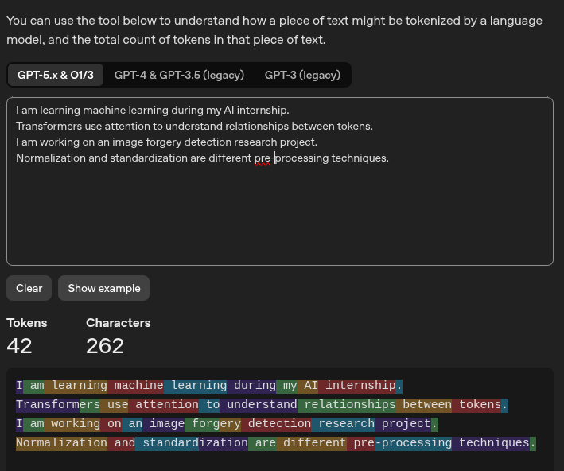

### Tokenization Observation

The tokenizer converted my 4 sentences into **42 tokens** and **262 characters**.

I observed that tokens are not always equal to complete words. Some words or word parts can be represented as separate tokens, while punctuation and spaces can also affect tokenization.

This shows that LLMs process text as tokens rather than directly processing complete words. Therefore, context-window limits and token usage are based on tokens, not simply on the number of words or characters.

### Context Window Observation

A context window defines how many tokens a model can consider within a request. For example, with a 4,000-token context window and an average of 100 tokens per user message and 100 tokens per assistant response, one back-and-forth turn consumes 200 tokens.

Therefore, approximately 20 back-and-forth turns can consume the available context window:

$$
4000 \div 200 = 20
$$

In a real application, the available space can be lower because system instructions, conversation history, prompts, and other context also consume tokens.

### "Why does the model forget old messages?"

When the conversation becomes larger than the available context window, the application may truncate or remove older parts of the conversation. The model then cannot use those removed tokens in its current context.

# Part B — Prompting Techniques with Llama 3.1 8B

## Objective

In this task, I tested three prompting techniques using the locally running **Llama 3.1 8B** model through **Ollama**:

1. Zero-Shot Prompting
2. Few-Shot Prompting
3. Chain-of-Thought (CoT) Prompting

The purpose of this task was to understand how different prompting techniques guide an LLM and how they can affect the model's response and response time.

---

## Model and Runtime

- **Model:** Llama 3.1 8B
- **Runtime:** Ollama
- **Execution:** Local machine
- **Model size:** Approximately 8 billion parameters

The model was executed locally using Ollama instead of a cloud-based API.

---

## Response Time Measurement

I measured the response time of each experiment using the Linux `/usr/bin/time` command with Ollama.

```bash
/usr/bin/time -f "Response time: %e seconds" ollama run llama3.1:8b "prompt"
```

---

## 1. Zero-Shot Prompting

### Concept

Zero-shot prompting means giving the model a task without providing any examples.

The model has to understand the task from the instruction alone.

### Prompt

```
Classify the sentiment of this customer review as Positive, Negative, or Neutral.

Review:
"The delivery was late and the product arrived damaged."

Return only the sentiment label.
```

### Result

```
Negative
```

### Response Time

**2.90 seconds**

### Observation

The model correctly classified the review as Negative without being given any examples.

This shows that zero-shot prompting is useful when the task instruction is clear and the model can understand what is required without additional demonstrations.

---

## 2. Few-Shot Prompting

### Concept

Few-shot prompting means providing the model with a small number of examples before asking it to perform the actual task.

The examples help the model understand the expected task and output format.

### Prompt

```
Classify each customer review as Positive, Negative, or Neutral.

Examples:

Review: "The product quality is excellent."
Sentiment: Positive

Review: "The package arrived broken."
Sentiment: Negative

Review: "The order was delivered on Monday."
Sentiment: Neutral

Now classify:

Review:
"The delivery was late and the product arrived damaged."

Return only the sentiment label.
```

### Result

```
Negative
```

### Response Time

**6.01 seconds**

### Observation

The model correctly classified the review as Negative after seeing three examples.

The examples provided additional guidance about how the task should be performed and how the answer should be formatted.

Compared with zero-shot prompting, the few-shot prompt was longer because it included examples. In this experiment, it also had a higher measured response time.

---

## 3. Chain-of-Thought (CoT) Prompting

### Concept

Chain-of-Thought prompting asks the model to solve a problem by working through the reasoning steps before providing the final answer.

It is particularly useful for multi-step mathematical or logical tasks.

### Prompt

```
A customer ordered 3 notebooks for $5 each and 2 pens for $2 each.
They paid $25. How much change should they receive?

Solve the problem step by step and then provide the final answer.
```

### Model Response

The model generated the following reasoning:

```
3 notebooks × $5 = $15
2 pens × $2 = $4
Total cost = $15 + $4 = $19
Change = $25 − $19 = $6
```

### Final Answer

```
$6
```

### Response Time

**33.72 seconds**

### Observation

The model generated intermediate calculations before producing the final answer.

This made the reasoning process explicit and allowed the multi-step calculation to be followed more easily.

The response time was higher in this experiment because the model generated a substantially longer response containing multiple reasoning steps.

---

## Comparison of Prompting Techniques

| Technique | Examples | Task | Result | Response Time |
|---|---|---|---|---|
| Zero-Shot | 0 | Sentiment classification | Negative | 2.90 s |
| Few-Shot | 3 | Sentiment classification | Negative | 6.01 s |
| Chain-of-Thought | 0 | Multi-step calculation | $6 | 33.72 s |

---

## Overall Observation

The experiments showed that different prompting techniques provide different levels of guidance to a language model.

Zero-shot prompting provided only the task instruction. The model was able to correctly classify the sentiment without any examples.

Few-shot prompting provided three examples before the actual input. These examples helped demonstrate the expected classification behavior and output format. The model again produced the correct result.

Chain-of-Thought prompting was used for a multi-step calculation. The model was explicitly asked to solve the problem step by step, so it generated intermediate calculations before giving the final answer.

In my experiment, the response times were different across the three techniques. However, the response times should not be interpreted as a direct measurement of the efficiency of the prompting techniques because the tasks and generated output lengths were also different.

The CoT task produced the longest response and therefore had the highest measured response time.

---

## Key Learnings

- **Zero-shot prompting:** Perform a task without providing examples.
- **Few-shot prompting:** Provide a few examples to guide the model.
- **Chain-of-Thought prompting:** Ask the model to work through a multi-step problem before giving the final answer.
- Few-shot prompting can help demonstrate the expected format and task behavior.
- CoT can be useful for multi-step reasoning tasks.
- Prompt length and generated output can affect response time.
- Response time should be compared carefully when the tasks or output lengths are different.
- Ollama allows open-weight LLMs such as Llama 3.1 8B to be run locally without using a cloud API.
